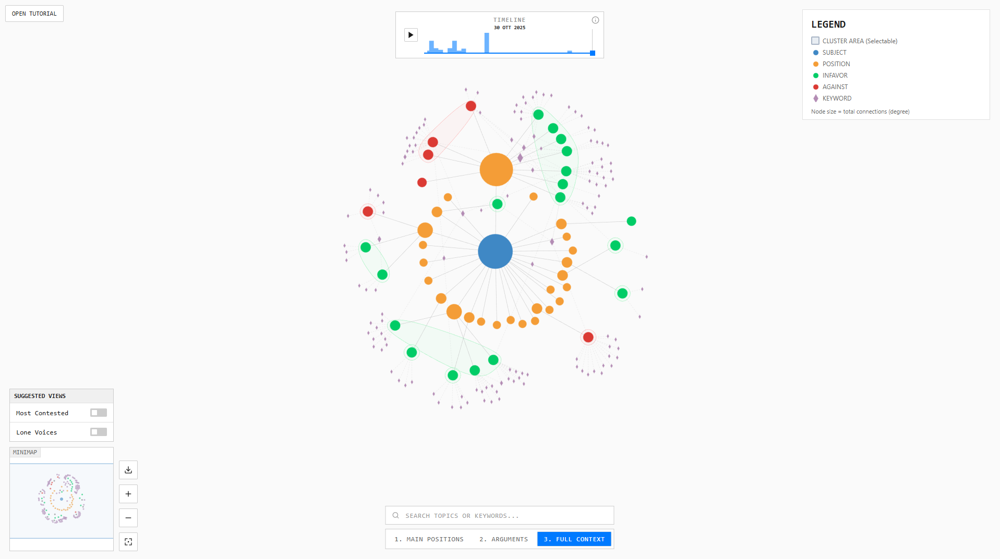

# Knowledge Graph Network Visualization (D3.js)

Interactive, web-based Knowledge Graph (KG) network visualization for exploring large-scale deliberative discussions through relational structure (who/what connects to what), argumentative stance (pro/contra), and semantic bridges (keywords and clusters).



## Why a Knowledge Graph for deliberation?

This visualization is designed to make the KG not only an internal data structure, but a communicative interface: it renders links among subject, positions, arguments, clusters, and keywords so that large discussions can be inspected at a scale that is difficult to manage with linear reading or purely aggregate charts.

Exploration is supported by:
- Timeline player (slider + playback)
- Depth levels (positions → arguments → full context)
- Guided tutorial (graph literacy and interface onboarding)
- Search, minimap, suggested views, and export

## Features

- Force-directed graph layout with semantic styling (colors, shapes, line styles)
- Node types: SUBJECT, POSITION, INFAVOR, AGAINST, ENTITY (keywords), CLUSTER (area/hull)
- Interactive tutorial driven by `data/tutorial.json`
- Timeline filtering and playback
- Depth navigation (progressive disclosure: 1/2/3)
- Minimap, search, and suggested views
- Export view as PNG or SVG

## Data model (inputs)

The visualization loads:
- `data/KG_nodes.csv` — nodes and their metadata
- `data/KG_edges.csv` — edges (source, target, relationship)
- `data/authors.json` — participant metadata (pseudonyms / IDs)
- `data/tutorial.json` — tutorial steps and visuals

## Run locally

Because browsers block CSV/JSON fetches from `file://` URLs, serve the project through a local HTTP server.

### Option A — Python

```bash
python -m http.server 8000
```

Open: `http://localhost:8000`

### Option B — Node

```bash
npx http-server -p 8000
```

## Publish as a GitHub Pages site

1. Push this repository to GitHub (public).
2. Go to Settings → Pages.
3. Select “Deploy from a branch”, choose `main` and `/ (root)`.
4. Save.

Your demo will be available at: `https://<username>.github.io/<repo>/`

## Repository structure

```text
.
├── css/
│   └── styles.css
├── data/
│   ├── tutorial.json
│   ├── authors.json
│   ├── KG_edges.csv
│   └── KG_nodes.csv
├── js/
│   └── script.js
├── assets/
│   └── screenshots/
│       ├── initial_grafana_kg.png
│       └── redesigned_kg.png
├── index.html
├── LICENSE
├── LICENSE-DATA
├── CITATION.cff
├── CONTRIBUTING.md
├── CODE_OF_CONDUCT.md
└── SECURITY.md
```

## Data privacy and governance (important)

Before publishing a public demo, verify that the dataset can be redistributed and that no personal data is exposed.
If `authors.json` contains identifiers that could be linked back to individuals, consider removing it from the public release or replacing IDs with hashed values.

## License

- Code: MIT License (see `LICENSE`).
- Data (`/data/*`): Creative Commons Attribution 4.0 International (see `LICENSE-DATA`).

## How to cite

If you use this repository in academic work, please cite it using the metadata in `CITATION.cff`.

## Acknowledgements

Add project acknowledgements here (e.g., BCause / ORBIS / data sources) as appropriate.
